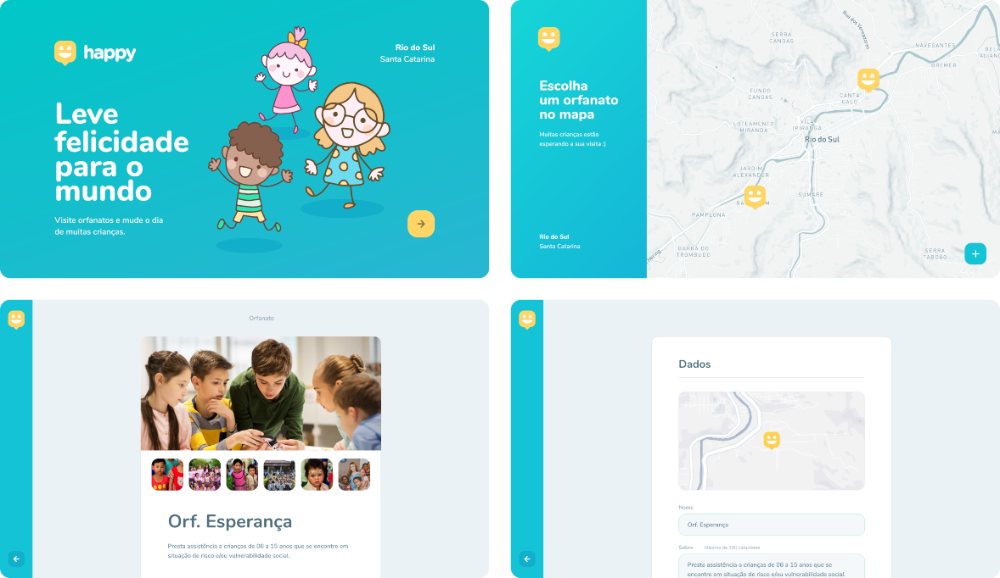
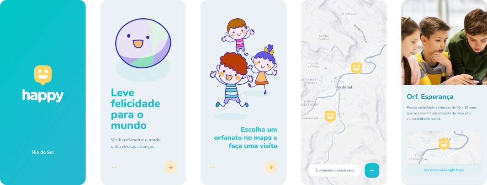

<div align="center">
  <div>
    
  </div>
</div>

> Projeto desenvolvido durante a Next Level Week #3 da [Rocketseat](https://rocketseat.com.br/) utilizando React, React Native, Expo e NodeJS.

## Overview
O **Happy é uma aplicação que conecta pessoas à casas de acolhimento institucionais**, atualmente focado exclusivamente à casas lares para fazer o dia de diversas crianças mais feliz. O intuito é ampliar o alcance da aplicação à outras modalidades de abrigos institucionais, como casas lares para pessoas idosas e residências inclusivas, por exemplo.

Atualmente a aplicação permite o **cadastramento das instituições** no banco de dados, assim como a **exibição das instituições cadastradas em um mapa** e as **informações detalhadas** de cada uma delas clicando em seu respectivo marcador no mapa. Sendo toda a utilização e navegação de forma fácil e intuitiva, através do uso de mapas na aplicação web e mobile.

## Technologies
O [TypeScript](https://www.typescriptlang.org/) é a linguagem de programação utilizada para o desenvolvimento de todo o projeto. Formalmente ela não é uma linguagem e sim um *superset* para o JavaScript que o torna mais robusto através de um conjunto de funcionalidades, sendo a principal a tipagem de variáveis. 

### Web
A aplicação web do projeto é uma **SPA - Single Page Application**, ou seja, um aplicativo de página única que não recarrega a página durante toda a utilização para fornecer uma melhor experiência ao usuário. **Desenvolvida utilizando [React](https://reactjs.org)**, um framework para construção de interfaces que facilita o recebimento de dados do servidor e o desenvolvimento de SPAs. Foi inicializado com [create react app](https://github.com/facebook/create-react-app) e também foram utilizadas bibliotecas como o [react-router-dom](https://reactrouter.com/) para trabalhar com rotas da aplicação, [react-leaflet](https://react-leaflet.js.org/) para trabalhar com os mapas e o [axios](https://github.com/axios/axios) realizar a conexão com o servidor.

<div align="center" >
  <div>
    
  </div>
</div>

### Mobile
A aplicação mobile, por sua vez, foi **desenvolvida utilizando o [React Native](https://facebook.github.io/react-native/)**, um framework que permite desenvolver aplicações mobile multiplataforma de forma flexível, produtiva, de fácil manutenção e reaproveitando conhecimentos. Também **utilizamos o [Expo](https://expo.io/)**, um framework que funciona como uma abstração para lidarmos com as funcionalidade nativas do dispositivo como, por exemplo, acesso a câmera e notificações. E outras bibliotecas, como o *axios* que já foi citado na aplicação web e o [react-navigation](https://reactnavigation.org/) para navegação entre as páginas da aplicação.

<div align="center" >
  <div>
    
  </div>
</div>

### Server
O back-end do projeto foi **desenvolvido utilizando [Node.js](https://nodejs.org/en/) com [Express](https://expressjs.com/pt-br/)**, uma biblioteca minimalista e robusta para trabalhar com rotas e desenvolver APIs. Assim, foi desenvolvido uma **API REST** com as seguintes funcionalidades:

- [X] Cadastramento de instituições
- [X] Listagem de instituições
- [X] Dados da instituição

O **banco de dados utilizado foi o SQLite3**, um banco de dados "embutido" que não utiliza SGBD separado para sua execução e possui recursos completos de um banco de dados, além de ser pequeno, rápido e de alta confiabilidade. E para trabalhar com o banco de dados foi utilizado a biblioteca [TypeORM](https://typeorm.io/) que é um ORM - Object Relationa Mapping, ou seja, é o maior nível de abstração para realizar *querys SQL* utilizando classes do JavaScript, o que torna possível migrar para diversos banco de dados sem alteração no código.

Outras ferramentas também foram utilizadas, como o [multer](https://github.com/expressjs/multer) para fazer o *upload* de arquivos, o [yup](https://github.com/jquense/yup) para fazer a validação dos dados de entrada no servidor e o [cors](http://expressjs.com/en/resources/middleware/cors.html) para o servidor ser acessível por outras aplicações de diferentes endereços, como a aplicação web e mobile.

## Setup
Primeiramente faça o download ou clonagem deste repositório e com o [Node.js](https://nodejs.org/en/) instalado execute o comando `npm install` no diretório `web`, `mobile` e `server` para realizar o download das dependências necessárias.

### Migrations
No diretório `server` execute os seguintes comando para executar ou reverter uma migração, respectivamente:
```sh
npm run typeorm migration:run
npm run typeorm migration:revert
```
### Run
Para executar as aplicações, primeiramente, inicialize o servidor digite no diretório `server` o comando:
```sh
npm run dev
```

Para executar a aplicação `web` e a aplicação `mobile`, digite nos diretórios respectivos o comando:
```sh
npm start
```
O servidor executará em `localhost:3333`, a aplicação web em `localhost:3000` e a aplicação mobile  em `localhost:19002`. Para abrir a aplicação mobile em seu próprio dispositivo físico ou em algum emulador é preciso ter o aplicativo Expo instalado.

Sempre conferir e alterar o IP, caso necessário, das URLs em `server/src/images_view.ts` e `mobile/src/services/api.ts`.

## [Next Steps](https://www.notion.so/Vers-o-2-0-do-Happy-7c123c82172c47f89a7083f4f78c285a)

Desafios para elevar o nível da aplicação implementando novas funcionalidades.

- [ ] Acesso restrito
- [ ] Recuperação de senhas
- [ ] Cadastro de instituições
- [ ] Splash Screen no React Native com Expo
- [ ] Onboarding do usuário
- [ ] Localização real do usuário
- [ ] Cadastro em múltiplas etapas
- [ ] Logout da aplicação
- [ ] Deploy da aplicação

## License 
Esse projeto está sob a licença MIT. Veja o arquivo [LICENSE](LICENSE.md) para mais detalhes.